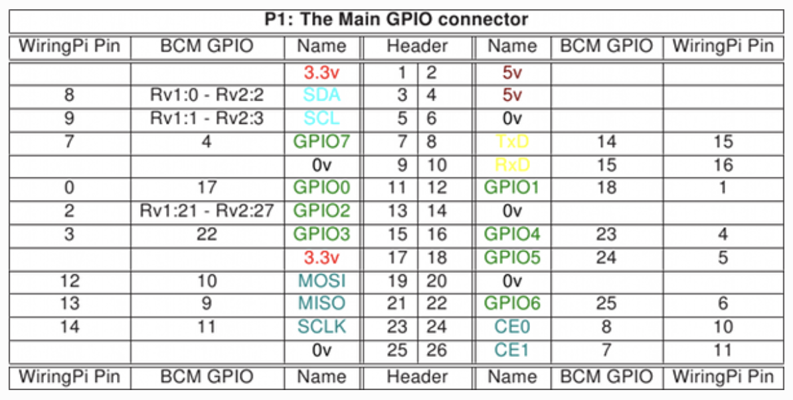

Raspberry Pi 2 Pin Layout
===========

.. image:: rp2_pinout.png
   :width: 400pt

Currently the main computer used by the tankmonitor project is the Raspberry Pi 2. Since we are outputting
to an outside display and receiving input in the form of button presses, we can use the pins and check if
they are “high” or “low” to determine if a button has been pushed and react accordingly.

One of the libraries that are being used, WiringPi, uses a custom pin layout convention. Below, is a block
of code from `tankmonitor.py` binding a WiringPi pin ID to GPIO pin on the Raspberry Pi.

.. code-block:: python
   :linenos:
   BTN_IN = 2  # wiringpi pin ID

   BTN_OUT = 3  # wiringpi pin ID

   VALVE_GPIO = 6  # wiringpi pin ID

Use the following diagram (http://wiringpi.com/pins/) to find the reciprocal pin identity. The header pin
numbers can be found under the “Header” column and the WiringPi pins numbers are found on the far right and
far left sides of the table.

For example, the VALVE_GPIO pin is set to 6, meaning that the WiringPi library identifies this
as the sixth pin. WiringPi pin 6 is in the bottom right corner and moving horizontally to the
centre, we reach header pin 22. This means that the valve opens and closes on signal from pin 22 on the
Raspberry Pi. Additionally, if pin 22 is low, the valve is open. If the pin is high, the valve is closed.

For quick-reference, here is a table of common pins the program uses

.. list-table::
   :widths: 50 30 30
   :header-rows: 1

   * - Name used in the tankmonitor project
     - WiringPi Pin ID
     - RPi GPIO Header Pin ID
   * - BTN_IN
     - 2
     - 13
   * - BTN_OUT
     - 3
     - 15
   * - VALVE_GPIO
     - 6
     - 22

The software is designed to ensure minimal downtime if a replacement for the Raspberry Pi is needed. If the
computer were to fail and a new one would need to be purchased, the WiringPi button IDs can be easily be changed
in `tankmonitor.py`.

Python Cheat Sheet
=============

The entire project, except for some shell scripts to start the Python
files, is built using Python. Here are some reminders on the conventions
and general structure of the language.

Variables
---------

Variables can be defined using their name and their value.

.. code:: python

   x = 1
   y = "Hello, world!"
   z = None

In the above example, the variables *x*, *y*, and *z* are initialized to
the values of *1*, the string *“Hello, world!”*, and *None*,
respectively.

*None* is an interesting value. At a high level, when setting a variable
to *None*, you are telling the program that the variable is nothing.

.. code:: python

   my_var = None
   assert my_var != ""
   assert my_var != 0
   assert my_var == None

Setting a variable to *None* does not make it equal to an empty string
or the number zero. The only possible value that will be equal to *None*
is *None*

The *None* data type is often used in the tankmonitor software for
instances where a “Dummy” or “Empty” variable might not make as much
sense during the program’s runtime, or generally confuse people reading
the code. For example, look at the method *log_level_reset_at()*,
located in *tankmonitor.py*.

.. code:: python

   def log_level_reset(self):
       global log_level_reset_at
       if log_level_reset_at is not None and log_level_reset_at < datetime.now():
           log.info("Resetting logging level to INFO")
           log.setLevel(logging.INFO)
           log_level_reset_at = None

The if statement in this method checks if the log level has ever been
reset (by checking if log_level_reset_at is any value other than *None*)
and if the log level has been reset in the past. If the
log_level_reset_at is a non-None value, it means that the log_level was
reset sometime in the past.

Functions
---------

Functions are instructions for the computer that can be repeated
multiple times.

.. code:: python

   def find_delta(record: TankLogRecord, prev_rec: TankLogRecord) -> Union[
      tuple[None, None],
      tuple[float, float]]:

       if prev_rec is None:
           return None, None
       interval = record.timestamp - prev_rec.timestamp
       if interval == 0:
           return None, None
       return interval, 60.0 * (record.value - prev_rec.value) / interval

This function, ``find_delta()``, defined to find the difference in value
between two different instances of ``TankLogRecord()``

Since we deal with many log records, we use a lot of functions
–technically methods– to control how we interact with the data. Methods
will be covered in the next section, classes.

Classes
-------

A class is very similar to a blueprint for an object. In this program,
we use classes to organize large data structures that are associated
with lots of information and logic, and objects that have multiple
instances.

.. code:: python

   @dataclass
   class TankAlert:
   """
    The TankAlert class is a dataclass representing a single data point that causes an alert    """
       timestamp: float
       value: float
       delta: Union[None, float]

For example, this ``TankAlert()`` data class (denoted by the
``@dataclass`` tag) contains a field for a timestamp value, a generic
value, and a delta.

There are two scenarios where a ``TankAlert()`` is triggered. - The tank
depth is too low, meaning there is not enough water in the tank - The
density of the water is in the tank is out of range.

In the tank-monitoring software, we create a list of ``TankAlerts()``
that can be used in future to analyze problems and patterns in the water
system (they are reported to the log file as well). This allows for
every ``TankAlert()`` to have its own timestamp (when it was recorded),
it’s own ``value``, and it’s own ``delta``, describing if the value has
gone up or down.

--------------

Secondly, classes can also be used for storing larger data types for
better organization. In this program, we have a ``ValveHandler()`` class
to make it easy to open and close the valve, as well as get the state of
the valve. Alongside these menial tasks, it also handles
user-authentication, making sure that only people with the right
credentials are allowed to modify the state of the valve.

What makes a method different from a function?
~~~~~~~~~~~~~~~~~~~~~~~~~~~~~~~~~~~~~~~~~~~~~~

Take a look at the method ``log_density()``, defined in the
``TankMonitor()`` class. This method takes a ``density`` value of type
float and records the value in the ``log`` file.

.. code:: python

   class TankMonitor(Application):

      ...

      def log_density(self, density: float):
          log.debug("Logging density: " + str(density))
          IOLoop.current().add_callback(partial(
          self._offer_log_record, 'density', time(), density))

The easiest way to tell a method from a function is by looking for the
``self`` argument in the function declaration. This ``self`` keyword
tells us that function is now a method defined for the ``TankMonitor()``
class.

We can call the ``log_density()`` method on all instances of the
``TankMonitor()`` class which is really useful for general code
organization and ensuring that the proper functions are used instead of
deciding to use one function over the other and being wrong.

When designing the software for this project, we knew that it was going
to be a good idea to structure it on the object-oriented-design
principle. For example, this line is of code is one of the first that is
executed.

.. code:: python

   app = TankMonitor(handlers, **tornado_settings)

This creates a new instance of ``TankMonitor()``, which the rest of our
code will reference. Throughout the app, it is easy to use the
``TankMonitor()`` class.

.. code:: python

   http_server = HTTPServer(app)
   maxbotix = MaxbotixHandler(tank_monitor=app, port='/dev/ttyAMA0', timeout=10)

Additionally, it’s very simple to call methods from ``TankMonitor()``

.. code:: python

   self.tank_monitor.log_density(
      self.send_command(
      b'\x01\x31\x41\x34\x36\x30\x0D\x00'
      ))

The ``log_density()`` method is being called on the ``TankMonitor()``
instance. Classes are extremely useful for organizing code in a way that
allows for multiple instances (copies) of a datatype and specific
methods that belong that type of data.

F.A.Q.
============

Possible concerns and answers for the project.

**How future-proof is this code?**

The code for the tankmonitor project is extremely future-proof and
robust, to the point where either the Raspberry Pi running the software
will fail or something unexpected happens. One of the main goals for
this project, converting the existing code to Python3, has been
completed successfully and the code works reliably.

For example, consider the following Python3 snippet.

.. code:: python

   def find_delta(
   	record:TankLogRecord,
   	prev_rec: TankLogRecord) -> Union[tuple[None, None], tuple[float, float]]:

       """
       The find_delta() function returns a tuple with two pieces of data.
       Information stored in the tuple:
   	    - Index 0: Interval in seconds.
   	    - Index 1: Rate of change per minute between the two log records

       What happens in the interval is 0?
   	An interval of zero means that the records were taken at the same time. The function will return the tuple (None, None) since the there is no change in time and therefore the rate of change is undefined.

   	The function will always return either (interval, rate of change) or (None, None)    """
   	if prev_rec is None:
           return None, None
       interval = record.timestamp - prev_rec.timestamp
       if interval == 0:
           return None, None
       return interval, 60.0 * (record.value - prev_rec.value) / interval

As well as converting the existing code to the newest version of Python
to ensure that it works with the latest Python interpreter, type hints
are also included.

**What are type hints?**

Type hinting is a new concept in Python3 that tells programmers what the
datatype of a variable or argument will be during runtime.

.. code:: python

   my_number: int = 42
   greeting: str = "Hello, World"

   def greet_people(what_to_say: str) -> None:
   	print(what_to_say + "!")

   greet_people(greeting)  # Code is interpreted correctly and prints "Hello, World!"
   greet_people(my_number) # Code is not interpreted correctly and error is reported

The above code creates a variable called ``greeting`` which holds the
``str`` data type. This can be passed into the ``greet_people()``
function, which take in one ``str`` argument. While not enforced, type
hints provide programmers with useful information relating to the type
of variable used, as to not create buggy code.

They are very good for showing other programmers, as well as your
future self, how a piece of code should be used.

**What is the best way to report errors?**

A log file (stored on the SD card) is always recording what’s happening
in the program while it is running. Additionally, the program may spit
out some error messages, the collection of error messages is called the
stack-trace. The best way to report errors is to send an email to either
Liam Weeks or Russ Weeks with the stack-trace and the log file.

When starting the system and running ``tankmonitor.py``, try/catch
blocks are used to record the error if setting up anything useful to the
program did not go as planned.

.. code:: python

   if __name__ == "__main__":  # Signifies the start of the program

   	...
   	try:  # Trying to set up the Maxbotix machine
       maxbotix = MaxbotixHandler(tank_monitor=app, port='/dev/ttyAMA0', timeout=10)
       maxbotix.calibrate(appconfig.MAXBOTICS['calibrate_m'],
                          appconfig.MAXBOTICS['calibrate_b'])
       maxbotix_thread = Thread(target=maxbotix.read)
       maxbotix_thread.daemon = True
       maxbotix_thread.start()
   	except Exception as e:  # Setup has failed, record the data.
       """
   	    If the program fails to set up the Maxbotix machine, it will record the error/stacktrace to the log file for further inspection.
       """
       log.error(f"Unable to setup MaxbotixHandler:\n{e}", exc_info=e)
       ...

This is a simplified block of code that starts the program, “simplified”
meaning that some parts of the code have been omitted to easily show the
important code for this step.

In this block of code, we attempt to start the Maxbotix Ultra-Sonic
Range Sensor. If that operation were to fail, we record the error
message (stored in ``e`` in the line ``except Exception as e``) and
record an error message in the log file.

The log-if-failed system works for the Maxbotix Ultra-Sonic Range Sensor, the Densitrak, and the LCD.

**How would you move to another Raspberry Pi?**

Moving to a Raspberry Pi would be quite simple. Since this Python code
is completely separate from the Raspberry Pi, it is easy to download
another copy of the code in the future without worrying about the old
Pi.

Python code runs on an interpreter that is installed on the Raspberry
Pi, meaning that any new Raspberry Pi will be able to run a Python
interpreter to run this project.

The code for the tankmonitor project is stored on the GitHub
(https:github.com/rweeks/tankmonitor)

::

   Tankmonitor Project Code
   	Python Interpreter
   	  Raspberry Pi
Here is a visualization for the structure of the project. The Tankmonitor project code
needs the Python Interpreter to run, which needs a Raspberry Pi.

**If you replace the Raspberry Pi, make sure to download and install a
suitable Python3 Interpreter.**
